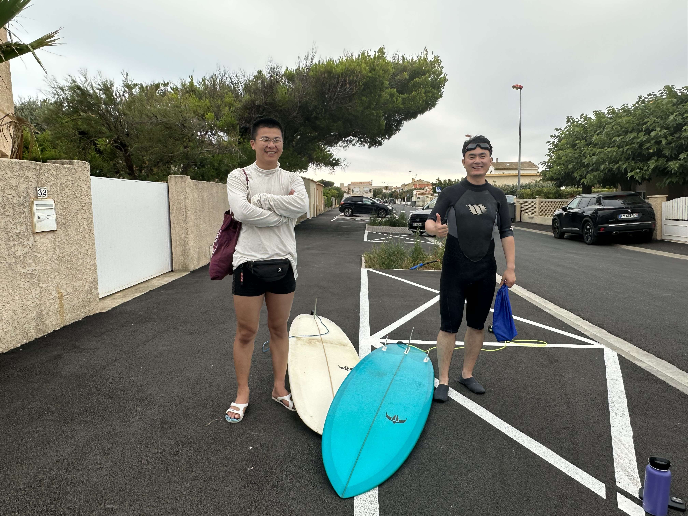



 Hi! I am keen on voluntary activities!  

# Summer Woofing Experience Summary

During my summer woofing experience, I engaged in a variety of tasks that provided me with unique insights into agricultural and cultural practices. The main responsibilities included:

| Task Name                | Detailed Description                                                                 | Pictures                                              |
|--------------------------|---------------------------------------------------------------------------------------|-------------------------------------------------------|
| Early Morning Grape Harvesting   | I actively participated in hand-harvesting grapes starting at 5 am each morning. This hands-on process allowed me to appreciate the labor and dedication required in vineyard work. |  |
| Swift Grape Processing   | Immediately after harvesting, we worked efficiently to process the fresh grapes. Within a mere 3 hours, we skillfully transformed them into pre-fermented grape juice. This step showcased the importance of timing and teamwork in preserving the quality of the harvest. |  |
| Thorough Crate Cleaning  | Ensuring the cleanliness and hygiene of the crates used for grape transportation was another crucial aspect of the job. This attention to detail contributed to the overall quality of the grape processing. |     |
| Culinary Exploration     | Beyond vineyard activities, I also had the opportunity to immerse myself in the local culture through food. I not only cooked traditional Chinese dishes but also savored authentic French cuisine. This culinary exchange enriched my cultural understanding. |     |
| Balancing Work and Leisure | During leisure hours, I ventured out to experience the surroundings. Engaging in activities like midday ocean surfing, rock climbing, Petanque, and seafood barbecues allowed me to unwind and connect with both nature and the local community. |       |

This summer woofing experience was a blend of hard work, cultural exchange, and personal relaxation. It provided me with valuable lessons and memories that I will carry forward.
